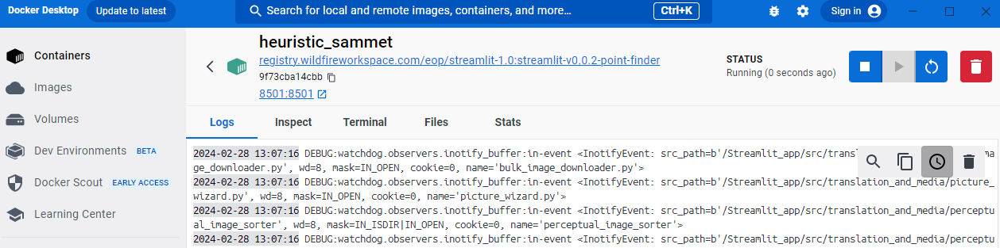
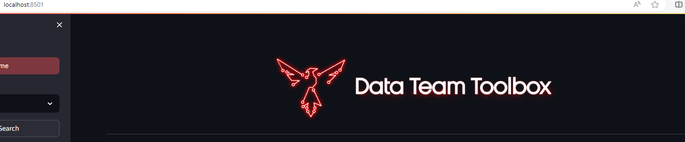

# Deploy

This document will outline the steps required to properly deploy DataToolbox.
DataToolbox can be deployed in two ways: utilizing docker containers or from source
code.

## Table of Contents

1. [Introduction](#deploy)
1. [Configuration](#configuration)
    1. [Environment Variables](#environment-variables)
    1. [Configuration Files](#configuration-files)
1. [Pre-Deployment Check](#pre-deployment-check)
1. [Network Specific Instructions](#network-specific-instructions)
    1. [F/G](#fg)
    1. [J's](#js)
    1. [S](#s)
1. [Limitations](#limitations)

## Configuration

Configuring the DataToolbox deployment is done through configuration files and
environment variables.

`environment/common.env` contains environment variables that are network-agnostic. \
**It is imperative that you ensure that both are correct for your deployment.** This will affect
which network the containers are configured for and the version number that is displayed in any UI elements.

`environment/*-net.env` contains network-specific environment variables.

`environment/tools/*.env` contains tool-specific environment variables.

`src/config/secrets.env` contains the password for the analytics. \
Set the variable `ANALYTICS_PASSWORD=*your_password*`. Defaults to
`Pl3@$e-set-the-password`

`src/.streamlit/config.toml` configures the Streamlit framework itself.

## Pre-Deployment Check

Before claiming a release is ready to deploy you need to conduct a local
sanity check. 

### Prerequisites

**Windows:** \
Ensure you have Docker Desktop installed and running.

**Linux:** \
Ensure you have Docker running using the following command.

```bash
sudo systemctl start docker
```

To allow Docker to run on start-up, execute the following command.

```bash
sudo systemctl enable docker
```

Check for the *nginx-network* and create it if it is not already there.

```bash
sudo docker network ls
sudo docker network create "nginx-network"
```

### Build

From within the source code directory that contains the Dockerfile
and `docker-compose.yml` execute the following command to build and
run the docker container.

(The `--env-file` option passes the version number and target network code
environment variables to the `docker-compose.yml`. However, passing environment 
variables to the `docker-compose.yml` is not the same thing as passing environment variables to the individual containers. The `env_file` attribute in the 
`docker-compose.yml` will pass environment variables to the containers. -Jessie)

```bash
docker compose --env-file ./environment/common.env up --build
```

If you encounter issues to the effect of container name
`datatoolbox-vX.Y.Z` is already in use, then you will need to
stop that container, remove it, and run the docker compose command
again. Don't worry; at this point most of it should be cached
so it should finish quickly.

```bash
docker ps -a
docker stop <container-name-or-id>
docker rm <container-name-or-id>
```

If it's still angry, remove the image corresponding to that container
as well and then try again.

```bash
docker images
docker rmi <image-name-or-id>
```

(Personally, when I am doing this locally or on dev, I tend to do the above
cleaning steps before I encounter any errors; just to make sure I have a
clean slate when I begin. -Sean)

Once the docker compose command completes and deploys the container,
open a browser and navigate to localhost:8051 and ensure the DataToolbox
is working as expected.

Alternatively if you are more comfortable using GUI based tools the following
instructions should point you in the right direction.

```cmd
# To pull down the container
docker login registry.wildfireworkspace.com
docker pull registry.wildfireworkspace.com/eop/streamlit-1.0:datatoolbox-vX.Y.Z
```

The following images should give an example of testing through the GUI on
Windows.
    
    
    

Once you are satisfied the docker image is ready to be deployed the process
across networks diverge.

## Network Specific Instructions

The following sections will outline the process to deploy DataToolbox to the
specific networks we target support for.

### F/G

The F and G networks are Docker ready. When deploying to these networks your
point of contact/coordination is the local network sysadmin.

#### Developers

The following instructions cover a developers responsibility in prepping for a
deployment to F/G.

1. Login to the dev-nh machine using ssh. Get the admin password from the
   sys admin (or one of your teammates) if you don't already know it.

    ```cmd
    ssh dt_admin@dev-nh.funnel.local
    ```

1. Clone or pull the updated code you want to deploy.

    ```bash
    git clone https://gitlab.wildfireworkspace.com/eop/streamlit-1.0.git
    cd streamlit-1.0
    git pull
    git checkout tags/vX.Y.Z
    ```

1. Ensure that the version number and target network settings are up to date. \
   (I use vim. -Sean)

    - Check the version number and target network in `environment/common.env`

1. Now run the compose command to build all images and containers.

    ```bash
    docker compose --env-file ./environment/common.env up --build
    ```

    

1. Navigate to <http://dev-nh:8051> to ensure the container runs successfully and
   is ready for production. Continue only if it is. (Cellex Search didn't work
   for me on dev, but worked fine on prod after it was deployed. Not sure what
   to make of it, but that might just be a thing. -Sean)

1. Now save the image to /data/images_prod where the sysadmin will expect it to
   be. Make sure that toolbox is still running when you save the image.

   ```bash
   docker image save -o /data/move-to-g/datatoolbox-vX.Y.Z.tar datatoolbox-vX.Y.Z
   ```

   (I use the `deployment_scripts/tar_and_feather.sh` script, but make sure that the
   list in the script shows all the images you want to save. -Jessie)

1. Relay to the sysadmin that the container is ready for them.

**At this point the developer is done.**

#### F/G Admins

Due to DataToolbox being behind Keycloak we use a docker compose file for
consistency for all apps that use docker on F. Below is an example of a
"docker compose.yml" file for DataToolbox. Also, F is using a tarball of the
toolbox image so that we can verify it is not reaching out to the internet when
deployed on F prod and other higher networks.

The same guidance applies for G.

To load an image from a tarball run the following command:

```bash
docker load -i datatoolbox-vX.Y.Z.tar
```

```yml
# Example docker-compose.yml
---
version: '3'
networks:
 nginx-network:
 external: true
services:
 streamlit-app:
  image: datatoolbox
  container_name: datatoolbox
  restart: unless-stopped
 build:
  context: .
  dockerfile: Dockerfile
 ports:
  - "8501:8501"
 networks:
  - nginx-network
 volumes:
  - toolbox-log:/var/log/toolbox
  - tesseract-data:/usr/share/tesseract-ocr/4.00/tessdata
  - feedback-data:/Streamlit_app/feedback_data  # Map the feedback data volume
 environment:
  - SL_ANALYTICS_PATH=/var/log/toolbox/analytics.log
volumes:
 tesseract-data:
 feedback-data:  # Define the volume for feedback data
 toolbox-log:
```

(If you have time in your deployment process, try the loading your tar locally
and running docker compose on it without internet. This is a decent simulation
of the process and environment on the production server, so you can head off
some potential errors ahead of time. Doing this on my local machine ahead of
time specifically helped with the 1.2.6 deployment. -Sean)

### J's

These networks are docker capable but require following a specific process
defined by an external organization, JADE. You will need an account to access
[JADE gitlab](https://gitlab.jadeuc.com). The DataToolbox project is
[here](https://gitlab.jadeuc.com/supported/lma/datatoolbox).
Their CI/CD process utilizes Kubernetes to automatically deploy our software.
You will need to understand [Helm](https://helm.sh/). They have documentation
about the
[pipeline](https://confluence.tools.jadeuc.com/display/EPT/JADE+CICD+Pipeline+KBA)
and about
[FROSTBITE](https://confluence.tools.jadeuc.com/display/EPT/Frostbite+User+Guide+PPTs)
that you should review.
Here's a primer on the expected
[git structure.](https://confluence.tools.jadeuc.com/display/EPT/Gitlab+Repo+Structure)

```cmd
# Ensure you have a local copy of the JADE repository on your machine.

git clone https://gitlab.jadeuc.com/supported/lma/datatoolbox.git

# Create a new branch to modify and test in before merging into dev/main
# either through the command line or in Gitlab

cd datatoolbox
git checkout <working-branch>

# As well as a local copy of the tagged version you want to deploy.

cd ..
git clone https://gitlab.wildfireworkspace.com/eop/streamlit-1.0.git
cd streamlit-1.0
git checkout tags/vX.Y.Z

# At this point you will strategically overwrite the updated code from the dev
# project into the JADE project. Exactly how you do this is up to you.
# One method may be git merging from streamlit to
# datatoolbox. DO NOT JUST BLINDLY COPY THIS but, you could also just
# strategically copy files like this:

robocopy streamlit\src\datatoolbox datatoolbox\src\datatoolbox /xd .git
```

Verify that a "chart" directory exists at the top level of your JADE project
code and that you have modified any values necessary for your deployment.

```yml
# datatoolbox/chart/values.yaml
---
tag: datatoolbox-v1.2.2 # The specific docker container you are referencing.
```

```yml
# datatoolbox/chart/Chart.yaml
---
appVersion: "1.2.2" # The version of the underlying app you are deploying.
```

The file datatoolbox/chart/templates/deployment.yaml contains the **HOW** to deploy.

Once you are satisfied you have made the necessary changes then commit the
code and watch the pipelines. Once all pipelines are green you are most likely
good to merge into dev/main and create a git version tag in the JADE project.
Let the JADE sponsor know that it's their turn to check
[FROSTBITE](https://frostbite.tools.jadeuc.com/).

*NOTE: It may also be possible to avoid the moving of source code here and just*
*upload a created docker image into the registry then only modify the Helm*
*but this requires research.*

### S

This network is not yet docker capable and requires a source code deployment.
Navigate to the
[releases](https://gitlab.wildfireworkspace.com/eop/streamlit-1.0/-/releases)
page where you can download a compressed version of the source code. Go through
the data transfer process to move the source code from F to S.
You will likely need to
Unzip the source code into the deployment directory of your choice. Next, create
a virtual environment for the source code to live in.

```bash
# Create the virtual environment.
python3 -m venv venv

# Activate the virtual environment
source ./venv/bin/activate

# Install the dependencies.
python3 -m pip install -r requirements.txt

# Run the code on Windows
SET SL_ANALYTICS_PATH=./logs && streamlit run main.py

# Run the code on Linux
EXPORT SL_ANALYTICS_PATH=./logs && streamlit run main.py
```

To improve even further you may want to setup a web server such as Nginx or
Apache to forward requests to the streamlit server. These resources may be of
help to you:

- [Port 80](https://docs.streamlit.io/knowledge-base/deploy/deploy-streamlit-domain-port-80)
- [Streamlit and Nginx](https://discuss.streamlit.io/t/how-to-use-streamlit-with-nginx/378/6)

## Limitations

For applications that will be deployed onto our internet facing network,
there are no limitations on what Python packages you can import.
For applications that will be deployed to other networks, the packages are
limited to the python standard library and approved packages.
