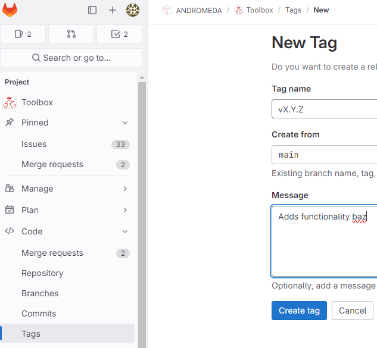

# Release

The following document will explain the process to follow when releasing
new versions of DataToolbox.

## Table of Contents

1. [Release Schedule](#release-schedule)
1. [Process](#process)
1. [Tags](#tags)

## Release Schedule

Generally, releases are created at your convenience and when the number of
upgrades warrants the work necessary to deploy them. Restrictions or processes
associated with the various networks have led to the following aspirational
cadence.

1. Deploy to F weekly.
1. Deploy to G monthly.
1. Deploy to J TBD.
1. Deploy to S TBD.

## Process

1. Decide as a team that you want to deploy the new features.
1. Modify the docker-compose.yml file to properly name the built image and
    container.

    ```yaml
    # streamlit-1.0/docker-compose.yml
    # This is the first part of the image container name and should already be
    # set
    name: datatoolbox
    services:
        vX.Y.Z: # This part will come after a "-" yielding datatoolbox-vX.Y.Z
    ```

1. Modify the `src/config/*-net.env` files to contain the proper version.

    ```ini
    # Find this line
    # Versioning
    VERSION = X.Y.Z
    ```

1. Merge the feature branch into main.
1. Create a [tag](#tags) on the main branch in Gitlab. In the left hand menu
    select the Code dropdown then Tags. Please ensure the Message is descriptive
    of the changes.\
    \
1. Tag creation triggers the dockerize job in the containerize pipeline in the
    [CI/CD](https://gitlab.wildfireworkspace.com/eop/streamlit-1.0/-/blob/main/.gitlab-ci.yml?ref_type=heads)
    that will build a docker container and then push it to the associated
    [container registry.](https://gitlab.wildfireworkspace.com/eop/streamlit-1.0/container_registry/173)
1. Once the pipeline completes, download the results of the security scans and
    transfer them to the local sys admins so they are aware of what is going on
    their network. In Gitlab CI/CD the "test" stage runs the "semgrep-sast"
    job which will create an artifact "gl-sast-report.json" that outlines
    potential code issues. After tagging the branch, the "containerize" stage
    will run a job named "container_scanning." This job will also output security
    scanning results that can be inspected/transferred.
1. At this point the process diverges and depends upon which network you are
    targeting. Reference [DEPLOY.md](./DEPLOY.md) for further instructions.

## Tags

The tag name will follow semantic versioning and be of the form vX.Y.Z where:

- X represents major changes such as changing from Streamlit to another UI library.
- Y represents minor changes such as adding/removing tools.
- Z represents code changes to current tools such as fixing bugs or updating UI.

Prefer bumping the minor and patch versions unless you *REALLY* feel a major
version bump is necessary. Bumping the major version usually triggers
administrative processes before software can be deployed.
